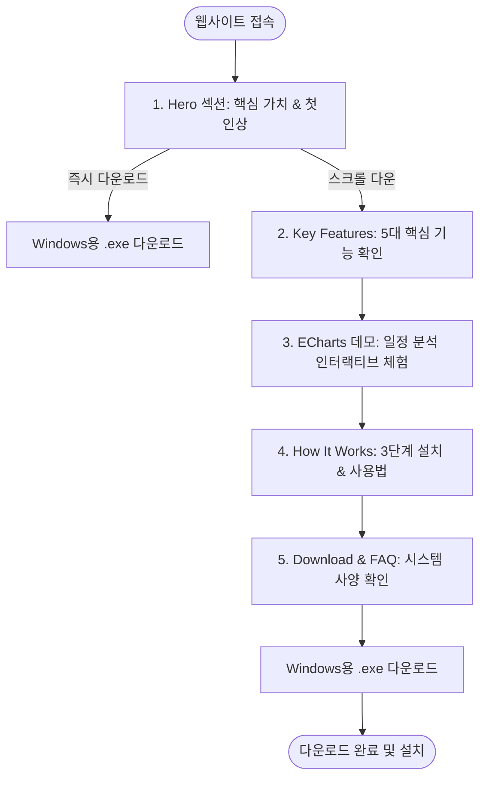

# 📱 웹사이트 화면 설계서 (Storyboard & Flowchart)

본 문서는 **Windows 데스크탑 캘린더 프로그램 소개 웹사이트**의 사용자 흐름(Flowchart), 화면 구성(Storyboard), 컴포넌트 구조 및 구현 체크리스트를 정의합니다.

---

## 1. 사용자 흐름도 (User Flowchart)

방문자가 웹사이트에 접속한 후 정보를 탐색하고 최종적으로 `.exe` 파일을 다운로드하는 흐름입니다.



---

## 2. 화면 스토리보드 & 와이어프레임 (Storyboard)

### [전체 페이지 레이아웃 와이어프레임]

```
+---------------------------------------------------------------------------------+
|  [Logo] Desktop Calendar          [기능]   [통계데모]   [사용법]   [⬇️ 다운로드]    | <- Navbar
+---------------------------------------------------------------------------------+
|                                                                                 |
|   [Badge] ✨ Windows 10/11 전용 데스크탑 앱                                      |
|                                                                                 |
|   [헤드카피]                                                                    |
|   복잡함은 빼고, 일정 관리는 확실하게                                           |
|   Windows를 위한 스마트 데스크탑 캘린더                                         |
|                                                     +-------------------------+ |
|   [서브카피]                                        |                         | |
|   트레이 상주, 스마트 알림, 100% 로컬 데이터 저장    |    데스크탑 캘린더      | | <- 1. Hero
|   가장 가볍고 직관적인 캘린더를 경험해보세요.       |    실행 화면 목업       | |
|                                                     |                         | |
|   [ ⬇️ Windows용 다운로드 (v1.0.0) ]  [ 기능 보기 ]   +-------------------------+ |
|   * Windows 10/11 (64-bit) 지원 | 무설치/설치형                                  |
|                                                                                 |
+---------------------------------------------------------------------------------+
|                                                                                 |
|   [섹션 헤더] 가볍지만 강력한 기능들 (Key Features)                             |
|                                                                                 |
|   +-----------------------+ +-----------------------+ +-----------------------+ |
|   | 🪟 시스템 트레이 상주   | | 🚀 PC 부팅 시 자동 시작 | | ⏰ 스마트 팝업 알림   | |
|   | 백그라운드에서 가볍게 | | 컴퓨터 켜자마자 오늘  | | 중요 일정과 마감일을  | | <- 2. Features
|   | 상주하며 빠른 접근    | | 일정을 바로 확인      | | 놓치지 않게 안내      | |
|   +-----------------------+ +-----------------------+ +-----------------------+ |
|   | 🌙 다크 모드 지원     | | 🔒 100% 로컬 저장      | | 📊 스마트 통계 분석   | |
|   | 눈이 편안한 Material  | | 서버 전송 없이 오프   | | 내 일정 패턴과 시간   | |
|   | 3 모던 디자인         | | 라인에서도 안전하게   | | 사용량을 한눈에       | |
|   +-----------------------+ +-----------------------+ +-----------------------+ |
|                                                                                 |
+---------------------------------------------------------------------------------+
|                                                                                 |
|   [섹션 헤더] 나의 일정 패턴을 한눈에 (Interactive Analytics)                    |
|   [카테고리별 비중]  [요일별 집중도]  [월간 추이]  <- (인터랙티브 탭 버튼)        |
|                                                                                 |
|   +---------------------------------------------------------------------------+ |
|   |                                                                           | |
|   |                       [ ECharts 차트 렌더링 영역 ]                        | | <- 3. Chart
|   |             (도넛 차트 / 요일별 바 차트 / 인터랙티브 툴팁)                | |    Section
|   |                                                                           | |
|   +---------------------------------------------------------------------------+ |
|                                                                                 |
+---------------------------------------------------------------------------------+
|                                                                                 |
|   [섹션 헤더] 3단계로 시작하기 (How It Works)                                   |
|                                                                                 |
|   +--------------------+     +--------------------+     +--------------------+  |
|   | 1. 프로그램 다운로드| ==> | 2. 트레이에서 실행 | ==> | 3. 스마트 일정 관리|  | <- 4. HowItWorks
|   | .exe 파일 1초 다운 |     | 백그라운드 자동등록|     | 팝업 알림과 통계   |  |
|   +--------------------+     +--------------------+     +--------------------+  |
|                                                                                 |
+---------------------------------------------------------------------------------+
|                                                                                 |
|   +---------------------------------------------------------------------------+ |
|   |  지금 바로 데스크탑 캘린더를 무료로 경험해보세요!                         | |
|   |  Windows 10 / 11 지원 (64-bit) | 최신 버전 v1.0.0                          | | <- 5. Download
|   |                                                                           | |    CTA Banner
|   |  [ ⬇️ Windows용 다운로드 (.exe) ]                                         | |
|   +---------------------------------------------------------------------------+ |
|                                                                                 |
+---------------------------------------------------------------------------------+
|  © 2026 Desktop Calendar App. All rights reserved.          [GitHub]  [Docs]    | <- 6. Footer
+---------------------------------------------------------------------------------+
```

---

## 3. 컴포넌트 아키텍처 (Component Hierarchy)

```
src/
├── components/
│   ├── Navbar.tsx           # 상단 고정 네비게이션 & 다운로드 바로가기 버튼
│   ├── Hero.tsx             # 메인 카피, 목업 이미지, 메인 다운로드 CTA 버튼
│   ├── Features.tsx         # 6개 핵심 기능 카드 그리드 (아이콘 + 제목 + 설명)
│   ├── ChartSection.tsx     # ECharts 기반 일정 통계 인터랙티브 시각화 컴포넌트
│   ├── HowItWorks.tsx       # 3단계 스텝별 가이드 카드
│   ├── DownloadSection.tsx  # 하단 다운로드 유도 배너 & 사양 안내
│   └── Footer.tsx           # 카피라이트, 깃허브 링크, 관련 문서
├── App.jsx (또는 App.tsx)    # 전체 섹션 레이아웃 조합
└── main.jsx                 # 엔트리 포인트
```

---

## 4. 컴포넌트별 상세 스펙 및 개발 체크리스트

### ① `Navbar.tsx`
- [ ] 로고 및 앱 이름 좌측 배치
- [ ] 각 섹션(기능, 통계, 사용법)으로 스크롤 이동하는 앵커/네비게이션 링크
- [ ] 우측 상단 강조된 `다운로드` 미니 버튼

### ② `Hero.tsx`
- [ ] 신뢰감을 주는 헤드라인 텍스트 및 서브 설명
- [ ] 눈에 띄는 대형 다운로드 버튼 (`bg-blue-600`, 아이콘 포함)
- [ ] 우측(또는 하단) 캘린더 앱 실행 목업 프레임 UI

### ③ `Features.tsx`
- [ ] 3x2 또는 2x3 반응형 그리드 (`grid grid-cols-1 md:grid-cols-2 lg:grid-cols-3 gap-6`)
- [ ] 각 카드: 호버 시 살짝 떠오르는 애니메이션 (`hover:-translate-y-1 transition-transform`)

### ④ `ChartSection.tsx` (ECharts)
- [ ] `echarts-for-react`를 활용한 차트 렌더링
- [ ] 상단 탭 버튼 클릭 시 차트 데이터 전환 (예: 카테고리별 시간 분배 vs 요일별 일정 수)

### ⑤ `HowItWorks.tsx`
- [ ] Step 1, 2, 3 순서가 한눈에 보이는 직관적인 가로 카드 레이아웃

### ⑥ `DownloadSection.tsx` & `Footer.tsx`
- [ ] 돋보이는 배경색의 다운로드 배너
- [ ] 릴리즈 버전(`v1.0.0`), 지원 환경(`Windows 10/11 64-bit`) 명시
